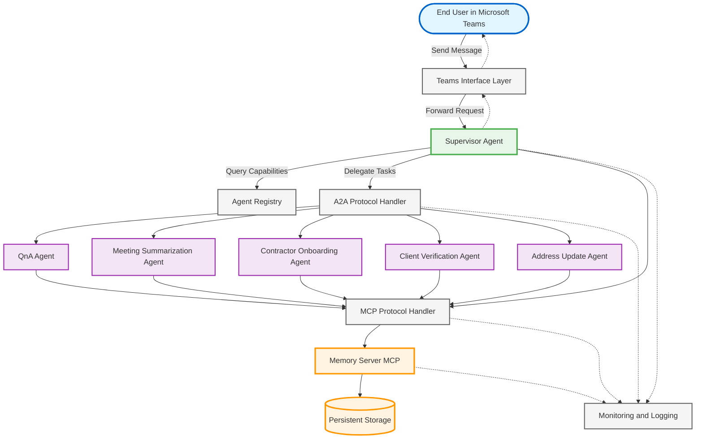

# Design Document: AgentCore Multi-Agent Architecture

## Overview

The AgentCore Multi-Agent Architecture is a scalable, distributed system that enables orchestrated collaboration between a supervisor agent and multiple specialist agents. The architecture leverages two key protocols: A2A (Agent-to-Agent) for inter-agent communication and MCP (Model Context Protocol) for tool integration, specifically memory management.

The system is designed with the following principles:
- **Decentralized execution**: Specialist agents operate independently, avoiding bottlenecks
- **Shared context**: All agents access a unified memory system via MCP
- **Dynamic routing**: The supervisor agent discovers and routes to specialist agents at runtime
- **Graceful degradation**: Component failures do not cascade; the system continues with reduced functionality
- **Horizontal scalability**: All components can scale independently based on load

The primary user interface is Microsoft Teams, where end users interact with the supervisor agent through natural language. The supervisor analyzes intent, delegates to appropriate specialist agents, and aggregates results into coherent responses.

## Architecture

### High-Level Architecture Diagram



**Memory Strategies:**
- USER_PREFERENCE: `/actor/{actorId}/strategy/USER_PREFERENCE`
- SEMANTIC: `/actor/{actorId}/strategy/SEMANTIC/{sessionId}`
- SUMMARY: `/actor/{actorId}/strategy/SUMMARY/{sessionId}`

### Communication Patterns

**1. User Request Flow (Teams → Supervisor → Specialist → Response)**
```
User → Teams Interface → Supervisor Agent → Agent Registry (capability discovery)
                                          → Specialist Agent(s) via A2A
                                          → Memory Server via MCP (context retrieval)
Specialist Agent → Memory Server via MCP (store results)
                → Supervisor Agent via A2A (return results)
Supervisor Agent → Teams Interface → User
```

**2. Parallel Execution Pattern**
```
Supervisor Agent → [Specialist A, Specialist B, Specialist C] (concurrent A2A calls)
                → Wait for all responses with timeout
                → Aggregate results
                → Return to user
```

**3. Agent Coordination Pattern (e.g., Contractor Onboarding)**
```
Supervisor → Contractor Onboarding Agent
          → Contractor Onboarding Agent → Client Verification Agent (A2A)
                                       → Memory Server (MCP)
          → Contractor Onboarding Agent → Supervisor (aggregated result)
```

### Deployment Architecture

All components run on the AgentCore Runtime platform:
- **Supervisor Agent**: Single instance with auto-scaling based on request volume
- **Specialist Agents**: Multiple instances per agent type, load-balanced
- **Memory Server**: Deployed as MCP server with persistent storage backend
- **Agent Registry**: Distributed registry with eventual consistency
- **Teams Interface**: Stateless gateway layer, horizontally scalable

## Components and Interfaces

### 1. Memory Server (MCP)

**Responsibilities:**
- Provide memory storage and retrieval via MCP protocol
- Enforce namespace isolation
- Support three memory strategies (USER_PREFERENCE, SEMANTIC, SUMMARY)
- Validate access permissions
- Manage persistent storage backend

**Interfaces:**

```python
from dataclasses import dataclass
from typing import Optional, Any, Dict, List
from enum import Enum
from datetime import datetime

class MemoryStrategy(Enum):
    USER_PREFERENCE = "USER_PREFERENCE"
    SEMANTIC = "SEMANTIC"
    SUMMARY = "SUMMARY"

@dataclass
class StoreRequest:
    actor_id: str
    strategy: MemoryStrategy
    data: Any
    session_id: Optional[str] = None  # Required for SEMANTIC and SUMMARY
    metadata: Optional[Dict[str, Any]] = None

@dataclass
class StoreResponse:
    success: bool
    namespace: str
    record_id: str
    error: Optional['ErrorInfo'] = None

@dataclass
class RetrieveRequest:
    actor_id: str
    strategy: MemoryStrategy
    session_id: Optional[str] = None
    record_id: Optional[str] = None
    filters: Optional[Dict[str, Any]] = None

@dataclass
class RetrieveResponse:
    success: bool
    data: List[Any]
    namespace: str
    error: Optional['ErrorInfo'] = None

@dataclass
class DeleteRequest:
    actor_id: str
    strategy: MemoryStrategy
    session_id: Optional[str] = None
    record_id: Optional[str] = None

@dataclass
class DeleteResponse:
    success: bool
    deleted_count: int
    error: Optional['ErrorInfo'] = None

@dataclass
class QueryRequest:
    actor_id: str
    strategy: MemoryStrategy
    query: str  # Query expression
    session_id: Optional[str] = None
    limit: Optional[int] = None
    offset: Optional[int] = None

@dataclass
class QueryResponse:
    success: bool
    results: List[Any]
    total_count: int
    error: Optional['ErrorInfo'] = None

@dataclass
class MemoryData:
    namespace: str
    strategy: MemoryStrategy
    data: Any
    timestamp: datetime
    ttl: Optional[int] = None  # Time to live in seconds

class MemoryServer:
    """Memory Server interface for MCP protocol"""
    
    async def store(self, request: StoreRequest) -> StoreResponse:
        """Store memory data"""
        raise NotImplementedError
    
    async def retrieve(self, request: RetrieveRequest) -> RetrieveResponse:
        """Retrieve memory data"""
        raise NotImplementedError
    
    async def delete(self, request: DeleteRequest) -> DeleteResponse:
        """Delete memory data"""
        raise NotImplementedError
    
    async def query(self, request: QueryRequest) -> QueryResponse:
        """Query memory data"""
        raise NotImplementedError
```

### 2. Supervisor Agent

**Responsibilities:**
- Receive user requests from Teams Interface
- Analyze intent and determine required specialist agents
- Invoke specialist agents via A2A protocol
- Aggregate results from multiple agents
- Format responses for Teams Interface
- Manage conversation flow and context

**Interfaces:**

```python
from dataclasses import dataclass
from typing import Optional, List, Dict, Any
from datetime import datetime

@dataclass
class UserRequest:
    actor_id: str          # User identifier from Teams
    session_id: str        # Conversation session identifier
    message: str           # User's message text
    timestamp: datetime
    metadata: 'RequestMetadata'

@dataclass
class UserResponse:
    message: str           # Response text
    adaptive_card: Optional['AdaptiveCard'] = None  # Rich formatting for Teams
    suggestions: Optional[List[str]] = None   # Follow-up suggestions
    metadata: Optional['ResponseMetadata'] = None

@dataclass
class Intent:
    primary_intent: str    # Main intent category
    confidence: float      # Confidence score 0-1
    entities: List['Entity']       # Extracted entities
    required_capabilities: List[str]  # Required agent capabilities

@dataclass
class Task:
    task_id: str
    task_type: str
    parameters: Dict[str, Any]
    context: 'TaskContext'

@dataclass
class AgentResult:
    agent_id: str
    task_id: str
    success: bool
    data: Any
    error: Optional['ErrorInfo'] = None
    metadata: Optional['ResultMetadata'] = None

class SupervisorAgent:
    """Supervisor Agent interface"""
    
    async def process_user_request(self, request: UserRequest) -> UserResponse:
        """Receive request from Teams Interface"""
        raise NotImplementedError
    
    def analyze_intent(self, message: str, context: 'ConversationContext') -> Intent:
        """Analyze intent and determine routing"""
        raise NotImplementedError
    
    def discover_agents(self, intent: Intent) -> List['SpecialistAgent']:
        """Discover available specialist agents"""
        raise NotImplementedError
    
    async def invoke_agent(self, agent: 'SpecialistAgent', task: Task) -> AgentResult:
        """Invoke specialist agent via A2A"""
        raise NotImplementedError
    
    async def invoke_agents_parallel(self, agents: List['SpecialistAgent'], tasks: List[Task]) -> List[AgentResult]:
        """Invoke multiple agents in parallel"""
        raise NotImplementedError
    
    def aggregate_results(self, results: List[AgentResult]) -> 'AggregatedResult':
        """Aggregate results from multiple agents"""
        raise NotImplementedError
    
    async def get_memory_context(self, actor_id: str, session_id: str) -> 'MemoryContext':
        """Access memory via MCP"""
        raise NotImplementedError
    
    async def store_memory_context(self, actor_id: str, session_id: str, context: 'MemoryContext') -> None:
        """Store memory context via MCP"""
        raise NotImplementedError
```

### 3. Specialist Agent (Base Interface)

**Responsibilities:**
- Receive tasks from Supervisor via A2A
- Execute domain-specific logic
- Access memory via MCP for context and storage
- Return results to Supervisor via A2A
- Handle errors gracefully

**Interfaces:**

```python
from dataclasses import dataclass
from typing import List, Optional
from datetime import datetime

@dataclass
class Capability:
    name: str
    description: str
    parameters: List['ParameterSchema']
    version: str

@dataclass
class HealthStatus:
    status: str  # "healthy" | "degraded" | "unhealthy"
    message: Optional[str] = None
    last_checked: Optional[datetime] = None

class SpecialistAgent:
    """Base interface for specialist agents"""
    
    def __init__(self, agent_id: str, capabilities: List[Capability]):
        self.agent_id = agent_id
        self.capabilities = capabilities
    
    async def process_task(self, task: Task) -> AgentResult:
        """Process task received via A2A"""
        raise NotImplementedError
    
    async def get_memory(self, namespace: str, strategy: MemoryStrategy) -> MemoryData:
        """Access memory via MCP"""
        raise NotImplementedError
    
    async def store_memory(self, namespace: str, strategy: MemoryStrategy, data: MemoryData) -> None:
        """Store memory via MCP"""
        raise NotImplementedError
    
    def health_check(self) -> HealthStatus:
        """Health check"""
        raise NotImplementedError
```

### 4. QnA Specialist Agent

**Specific Responsibilities:**
- Search knowledge base for relevant information
- Generate answers with source citations
- Store semantic facts about queries and answers
- Maintain conversation context

**Extended Interface:**

```python
from dataclasses import dataclass
from typing import List, Optional

@dataclass
class SearchResult:
    document_id: str
    title: str
    excerpt: str
    relevance_score: float
    source: str

@dataclass
class Answer:
    text: str
    confidence: float
    sources: List[SearchResult]
    related_questions: Optional[List[str]] = None

@dataclass
class SemanticFact:
    subject: str
    predicate: str
    object: str
    confidence: float
    timestamp: datetime

class QnAAgent(SpecialistAgent):
    """QnA Specialist Agent"""
    
    async def search_knowledge_base(self, query: str, filters: Optional['SearchFilters'] = None) -> List[SearchResult]:
        """Search knowledge base"""
        raise NotImplementedError
    
    async def generate_answer(self, query: str, results: List[SearchResult]) -> Answer:
        """Generate answer from search results"""
        raise NotImplementedError
    
    async def store_semantic_facts(self, actor_id: str, session_id: str, facts: List[SemanticFact]) -> None:
        """Store semantic facts about the interaction"""
        raise NotImplementedError
```

### 5. Meeting Summarization Agent

**Specific Responsibilities:**
- Process meeting transcripts or recordings
- Extract key topics, decisions, and action items
- Generate structured summaries
- Store summaries in memory

**Extended Interface:**

```python
from dataclasses import dataclass
from typing import List, Optional
from datetime import datetime

@dataclass
class Topic:
    name: str
    description: str
    duration: Optional[int] = None  # seconds

@dataclass
class Decision:
    description: str
    decision_maker: str
    rationale: Optional[str] = None

@dataclass
class ActionItem:
    description: str
    assignee: str
    due_date: Optional[datetime] = None
    priority: str  # "high" | "medium" | "low"

@dataclass
class MeetingSummary:
    meeting_id: str
    title: str
    participants: List[str]
    date: datetime
    topics: List[Topic]
    decisions: List[Decision]
    action_items: List[ActionItem]
    key_points: List[str]

class MeetingSummarizationAgent(SpecialistAgent):
    """Meeting Summarization Specialist Agent"""
    
    async def process_meeting(self, meeting_id: str, transcript: str) -> MeetingSummary:
        """Process meeting content"""
        raise NotImplementedError
    
    async def extract_topics(self, transcript: str) -> List[Topic]:
        """Extract structured information"""
        raise NotImplementedError
    
    async def extract_decisions(self, transcript: str) -> List[Decision]:
        """Extract decisions from transcript"""
        raise NotImplementedError
    
    async def extract_action_items(self, transcript: str) -> List[ActionItem]:
        """Extract action items from transcript"""
        raise NotImplementedError
    
    async def store_summary(self, actor_id: str, session_id: str, summary: MeetingSummary) -> None:
        """Store summary in memory"""
        raise NotImplementedError
```

### 6. Contractor Onboarding Agent

**Specific Responsibilities:**
- Manage contractor onboarding workflows
- Coordinate with Client Verification and Address Update agents
- Track onboarding progress
- Store contractor preferences and status

**Extended Interface:**

```python
from dataclasses import dataclass
from typing import List, Optional, Dict, Any
from datetime import datetime

@dataclass
class ContractorInfo:
    contractor_id: str
    name: str
    email: str
    role: str
    start_date: datetime
    manager: str
    department: str

@dataclass
class OnboardingStep:
    step_id: str
    name: str
    description: str
    status: str  # "pending" | "in_progress" | "completed" | "failed"
    assignee: Optional[str] = None
    due_date: Optional[datetime] = None

@dataclass
class OnboardingWorkflow:
    workflow_id: str
    contractor_id: str
    steps: List[OnboardingStep]
    status: 'WorkflowStatus'

@dataclass
class OnboardingStatus:
    workflow_id: str
    overall_progress: float  # 0-100
    completed_steps: int
    total_steps: int
    pending_steps: List[OnboardingStep]
    blockers: Optional[List[str]] = None

@dataclass
class ContractorPreferences:
    communication_preferences: Dict[str, Any]
    working_hours: str
    timezone: str
    custom_settings: Dict[str, Any]

class ContractorOnboardingAgent(SpecialistAgent):
    """Contractor Onboarding Specialist Agent"""
    
    async def initiate_onboarding(self, contractor_info: ContractorInfo) -> OnboardingWorkflow:
        """Initiate onboarding workflow"""
        raise NotImplementedError
    
    async def get_onboarding_status(self, contractor_id: str) -> OnboardingStatus:
        """Get onboarding status"""
        raise NotImplementedError
    
    async def request_client_verification(self, contractor_id: str, verification_data: 'VerificationData') -> 'VerificationResult':
        """Coordinate with other specialist agents"""
        raise NotImplementedError
    
    async def request_address_update(self, contractor_id: str, address_data: 'AddressData') -> 'AddressUpdateResult':
        """Request address update from Address Update Agent"""
        raise NotImplementedError
    
    async def store_contractor_preferences(self, contractor_id: str, preferences: ContractorPreferences) -> None:
        """Store contractor preferences"""
        raise NotImplementedError
```

### 7. Client Verification Agent

**Specific Responsibilities:**
- Verify client identity and credentials
- Validate contractor information against client databases
- Perform background checks and compliance verification
- Store verification results

**Extended Interface:**

```python
from dataclasses import dataclass
from typing import List, Optional
from datetime import datetime

@dataclass
class Document:
    """Document data class"""
    pass  # Define based on specific needs

@dataclass
class PersonalInfo:
    """Personal information data class"""
    pass  # Define based on specific needs

@dataclass
class VerificationData:
    contractor_id: str
    identity_documents: List[Document]
    personal_info: PersonalInfo
    verification_level: str  # "basic" | "standard" | "enhanced"

@dataclass
class VerificationResult:
    verification_id: str
    contractor_id: str
    status: str  # "verified" | "pending" | "failed"
    verified_fields: List[str]
    failed_fields: Optional[List[str]] = None
    expiration_date: Optional[datetime] = None
    message: str = ""

@dataclass
class BackgroundCheckResult:
    check_id: str
    check_type: str
    status: str  # "clear" | "pending" | "flagged"
    findings: Optional[List[str]] = None
    completed_date: Optional[datetime] = None

@dataclass
class ComplianceRequirement:
    requirement_id: str
    requirement_type: str
    description: str
    mandatory: bool

@dataclass
class ComplianceResult:
    compliant: bool
    satisfied_requirements: List[str]
    unsatisfied_requirements: Optional[List[str]] = None
    expiration_date: Optional[datetime] = None

class ClientVerificationAgent(SpecialistAgent):
    """Client Verification Specialist Agent"""
    
    async def verify_identity(self, verification_data: VerificationData) -> VerificationResult:
        """Verify client identity"""
        raise NotImplementedError
    
    async def perform_background_check(self, contractor_id: str, check_type: str) -> BackgroundCheckResult:
        """Perform background check"""
        raise NotImplementedError
    
    async def validate_compliance(self, contractor_id: str, requirements: List[ComplianceRequirement]) -> ComplianceResult:
        """Validate compliance requirements"""
        raise NotImplementedError
    
    async def store_verification_results(self, contractor_id: str, results: VerificationResult) -> None:
        """Store verification results"""
        raise NotImplementedError
```

### 8. Address Update Agent

**Specific Responsibilities:**
- Process address change requests
- Validate address information
- Update address records across systems
- Notify relevant parties of address changes

**Extended Interface:**

```python
from dataclasses import dataclass
from typing import List, Optional
from datetime import datetime

@dataclass
class Address:
    street: str
    city: str
    state: str
    postal_code: str
    country: str
    address_type: str  # "residential" | "mailing" | "business"

@dataclass
class AddressUpdateRequest:
    request_id: str
    contractor_id: str
    new_address: Address
    effective_date: datetime
    reason: str

@dataclass
class AddressValidationResult:
    valid: bool
    standardized_address: Optional[Address] = None
    errors: Optional[List[str]] = None
    warnings: Optional[List[str]] = None

@dataclass
class UpdateStatus:
    system: str
    success: bool
    timestamp: datetime
    error: Optional[str] = None

@dataclass
class AddressUpdateResult:
    request_id: str
    success: bool
    updated_systems: List[str]
    failed_systems: Optional[List[str]] = None
    message: str = ""

@dataclass
class NotificationResult:
    notifications_sent: int
    recipients: List[str]
    failures: Optional[List[str]] = None

class AddressUpdateAgent(SpecialistAgent):
    """Address Update Specialist Agent"""
    
    async def process_address_update(self, update_request: AddressUpdateRequest) -> AddressUpdateResult:
        """Process address update request"""
        raise NotImplementedError
    
    async def validate_address(self, address: Address) -> AddressValidationResult:
        """Validate address"""
        raise NotImplementedError
    
    async def update_address_in_systems(self, contractor_id: str, address: Address, systems: List[str]) -> List[UpdateStatus]:
        """Update address in systems"""
        raise NotImplementedError
    
    async def notify_address_change(self, contractor_id: str, old_address: Address, new_address: Address) -> NotificationResult:
        """Notify parties of address change"""
        raise NotImplementedError
```

### 9. Agent Registry

**Responsibilities:**
- Register specialist agents and their capabilities
- Provide capability discovery
- Track agent health and availability
- Support dynamic agent registration

**Interfaces:**

```python
from dataclasses import dataclass
from typing import List, Dict, Any, Optional
from datetime import datetime

@dataclass
class AgentRegistration:
    agent_id: str
    agent_type: str
    capabilities: List[Capability]
    endpoint: str
    metadata: Dict[str, Any]

@dataclass
class RegistrationResult:
    success: bool
    agent_id: str
    error: Optional['ErrorInfo'] = None

@dataclass
class AgentInfo:
    agent_id: str
    agent_type: str
    capabilities: List[Capability]
    endpoint: str
    health_status: HealthStatus
    registered_at: datetime
    last_heartbeat: datetime

class AgentRegistry:
    """Agent Registry interface"""
    
    async def register_agent(self, registration: AgentRegistration) -> RegistrationResult:
        """Register agent"""
        raise NotImplementedError
    
    async def unregister_agent(self, agent_id: str) -> None:
        """Unregister agent"""
        raise NotImplementedError
    
    async def discover_by_capability(self, capability: str) -> List[AgentInfo]:
        """Discover agents by capability"""
        raise NotImplementedError
    
    async def get_all_agents(self) -> List[AgentInfo]:
        """Get all registered agents"""
        raise NotImplementedError
    
    async def update_health_status(self, agent_id: str, status: HealthStatus) -> None:
        """Update agent health status"""
        raise NotImplementedError
    
    async def get_agent_info(self, agent_id: str) -> AgentInfo:
        """Get agent info"""
        raise NotImplementedError
```

### 10. Teams Interface Layer

**Responsibilities:**
- Receive messages from Microsoft Teams
- Map Teams user identity to actorId
- Generate and manage sessionIds
- Format responses for Teams (adaptive cards, rich text)
- Handle typing indicators and async responses

**Interfaces:**

```python
from dataclasses import dataclass
from typing import List, Optional
from datetime import datetime

@dataclass
class TeamsUser:
    id: str
    name: str
    email: str
    tenant_id: str

@dataclass
class Attachment:
    """Attachment data class"""
    pass  # Define based on specific needs

@dataclass
class TeamsMessage:
    message_id: str
    conversation_id: str
    from_user: TeamsUser
    text: str
    timestamp: datetime
    attachments: Optional[List[Attachment]] = None

@dataclass
class CardElement:
    """Adaptive Card element"""
    pass  # Define based on specific needs

@dataclass
class CardAction:
    """Adaptive Card action"""
    pass  # Define based on specific needs

@dataclass
class AdaptiveCard:
    type: str  # "AdaptiveCard"
    version: str
    body: List[CardElement]
    actions: Optional[List[CardAction]] = None

class TeamsInterface:
    """Teams Interface Layer"""
    
    async def on_message_received(self, teams_message: TeamsMessage) -> None:
        """Receive message from Teams"""
        raise NotImplementedError
    
    async def send_response(self, response: UserResponse, conversation_id: str) -> None:
        """Send response to Teams"""
        raise NotImplementedError
    
    async def send_typing_indicator(self, conversation_id: str) -> None:
        """Send typing indicator"""
        raise NotImplementedError
    
    def map_user_to_actor(self, teams_user_id: str) -> str:
        """Map Teams user to actorId"""
        raise NotImplementedError
    
    def get_or_create_session(self, conversation_id: str) -> str:
        """Get or create session"""
        raise NotImplementedError
```

## Data Models

### Memory Namespace Structure

The memory system uses hierarchical namespaces to organize data:

**USER_PREFERENCE Strategy:**
```
/actor/{actorId}/strategy/USER_PREFERENCE
```
- Stores long-term user preferences
- No sessionId (preferences persist across sessions)
- Examples: communication preferences, notification settings, default values

**SEMANTIC Strategy:**
```
/actor/{actorId}/strategy/SEMANTIC/{sessionId}
```
- Stores conversation facts and context
- Scoped to specific session
- Examples: extracted entities, semantic facts, conversation history

**SUMMARY Strategy:**
```
/actor/{actorId}/strategy/SUMMARY/{sessionId}
```
- Stores conversation summaries
- Scoped to specific session
- Examples: meeting summaries, conversation summaries, key takeaways

### A2A Message Format

```python
from dataclasses import dataclass
from typing import Optional, Dict, Any
from datetime import datetime

@dataclass
class RetryPolicy:
    max_attempts: int
    backoff_multiplier: float
    initial_delay_ms: int

@dataclass
class MessageMetadata:
    priority: str  # "high" | "normal" | "low"
    timeout: Optional[int] = None  # Milliseconds
    retry_policy: Optional[RetryPolicy] = None

@dataclass
class A2APayload:
    task: Optional[Task] = None           # For request messages
    result: Optional[AgentResult] = None  # For response messages
    error: Optional['ErrorInfo'] = None   # For error messages

@dataclass
class A2AMessage:
    message_id: str
    message_type: str  # "request" | "response" | "error"
    from_agent: str          # Sender agentId
    to_agent: str            # Recipient agentId
    timestamp: datetime
    payload: A2APayload
    metadata: MessageMetadata
    correlation_id: Optional[str] = None  # For request-response correlation
```

### Error Information Model

```python
from dataclasses import dataclass
from typing import Optional, Dict, Any
from datetime import datetime

@dataclass
class ErrorInfo:
    error_code: str
    error_message: str
    error_type: str  # "validation" | "timeout" | "unavailable" | "unauthorized" | "internal"
    timestamp: datetime
    recoverable: bool
    details: Optional[Dict[str, Any]] = None
```

### Configuration Model

```python
from dataclasses import dataclass
from typing import List, Dict, Any

@dataclass
class AutoScalingConfig:
    enabled: bool
    min_instances: int
    max_instances: int
    target_cpu: float
    target_memory: float

@dataclass
class SupervisorConfig:
    max_concurrent_requests: int
    default_timeout: int
    intent_analysis_model: str

@dataclass
class AgentConfig:
    agent_type: str
    instances: int
    auto_scaling: AutoScalingConfig
    timeout: int

@dataclass
class MemoryConfig:
    endpoint: str
    timeout: int
    cache_enabled: bool
    cache_ttl: int

@dataclass
class A2AConfig:
    timeout: int
    retry_policy: RetryPolicy
    max_parallel_invocations: int

@dataclass
class AlertThresholds:
    error_rate: float
    latency_p95: float
    memory_usage: float

@dataclass
class MonitoringConfig:
    metrics_enabled: bool
    tracing_enabled: bool
    log_level: str  # "debug" | "info" | "warn" | "error"
    alert_thresholds: AlertThresholds

@dataclass
class SystemConfiguration:
    supervisor: SupervisorConfig
    agents: List[AgentConfig]
    memory: MemoryConfig
    a2a: A2AConfig
    monitoring: MonitoringConfig
```

## Correctness Properties

A property is a characteristic or behavior that should hold true across all valid executions of a system—essentially, a formal statement about what the system should do. Properties serve as the bridge between human-readable specifications and machine-verifiable correctness guarantees.

### Property 1: Request Context Completeness

*For any* user request submitted via Microsoft Teams, when received by the Supervisor_Agent, the request SHALL contain all required context fields (actorId, sessionId, message text, timestamp).

**Validates: Requirements 1.1**

### Property 2: Multi-Agent Orchestration

*For any* request requiring multiple specialist agents, when the Supervisor_Agent coordinates execution, all agents SHALL execute according to the specified pattern (sequential or parallel) and all results SHALL be collected.

**Validates: Requirements 1.3**

### Property 3: Result Aggregation Completeness

*For any* set of specialist agent results, when the Supervisor_Agent aggregates them, the output SHALL be a valid formatted response containing data from all successful agents.

**Validates: Requirements 1.4**

### Property 4: A2A Message Structure

*For any* A2A message sent by the AgentCore_Runtime, the message SHALL contain all required fields (messageId, from, to, timestamp, payload) with valid values.

**Validates: Requirements 2.2**

### Property 5: A2A Round-Trip Communication

*For any* specialist agent invocation via A2A, when the agent processes the request, it SHALL return results using the A2A protocol with proper message correlation.

**Validates: Requirements 2.3**

### Property 6: Retry with Exponential Backoff

*For any* A2A communication failure, the AgentCore_Runtime SHALL retry exactly 3 times with exponentially increasing delays before returning an error.

**Validates: Requirements 2.4**

### Property 7: Memory Namespace Enforcement

*For any* memory storage operation, the Memory_Server SHALL enforce the correct namespace structure based on the strategy: `/actor/{actorId}/strategy/USER_PREFERENCE` for preferences, `/actor/{actorId}/strategy/SEMANTIC/{sessionId}` for semantic facts, or `/actor/{actorId}/strategy/SUMMARY/{sessionId}` for summaries.

**Validates: Requirements 3.2, 3.3, 3.4**

### Property 8: Memory Access Isolation

*For any* memory retrieval request, the Memory_Server SHALL return only data from the requesting actor's namespace and SHALL NOT return data from other actors' namespaces.

**Validates: Requirements 3.5**

### Property 9: Error Message Safety

*For any* memory operation failure, the error message SHALL contain a description of the error but SHALL NOT contain sensitive system details (stack traces, internal paths, credentials).

**Validates: Requirements 3.6**

### Property 10: Specialist Agent Delegation via A2A

*For any* specialist agent type (QnA, Meeting Summarization, Contractor Onboarding, Client Verification, Address Update), when the Supervisor_Agent delegates a task, the delegation SHALL use the A2A protocol.

**Validates: Requirements 4.1, 5.1, 6.1, 7.1**

### Property 11: QnA Result Structure

*For any* QnA agent result, the result SHALL include confidence scores and source references.

**Validates: Requirements 4.5**

### Property 12: Meeting Summary Structure

*For any* meeting summary generated by the Meeting_Summarization_Agent, the summary SHALL contain sections for topics, decisions, and action items.

**Validates: Requirements 5.3, 5.5**

### Property 13: Agent Coordination

*For any* contractor onboarding workflow, when the Contractor_Onboarding_Agent processes the request, it SHALL invoke other specialist agents (Client Verification, Address Update) via A2A as needed.

**Validates: Requirements 6.3**

### Property 14: Onboarding Status Report Structure

*For any* completed onboarding workflow, the status report SHALL contain both completed items and pending items.

**Validates: Requirements 6.5**

### Property 15: Access Change Audit Logging

*For any* access grant or revoke operation, the Access_Management_Agent SHALL log the change in the Memory_Server with timestamp and actor information.

**Validates: Requirements 7.4**

### Property 16: Access Operation Confirmation

*For any* completed access operation, the Access_Management_Agent SHALL return a confirmation containing details of the changes made.

**Validates: Requirements 7.5**

### Property 17: Concurrent Request Processing

*For any* set of simultaneous requests up to the configured limit, the Supervisor_Agent SHALL process them concurrently without blocking.

**Validates: Requirements 8.2**

### Property 18: Session Continuity During Scaling

*For any* agent instance scaling event (up or down), session data SHALL persist and remain accessible without data loss.

**Validates: Requirements 8.5**

### Property 19: Failure Detection and Recovery

*For any* specialist agent failure, the Supervisor_Agent SHALL detect the failure within 30 seconds and attempt recovery.

**Validates: Requirements 9.1**

### Property 20: Graceful Degradation with Memory Unavailability

*For any* specialist agent, when the Memory_Server is unavailable, the agent SHALL continue processing requests (with degraded functionality) and SHALL queue memory operations for later execution.

**Validates: Requirements 9.3**

### Property 21: Timeout Error Handling

*For any* A2A communication timeout, the AgentCore_Runtime SHALL log the timeout and return a timeout error to the calling agent.

**Validates: Requirements 9.4**

### Property 22: Dual Error Logging

*For any* system error, the AgentCore_Runtime SHALL log detailed error information for debugging AND return a user-friendly error message (without technical details) to the user.

**Validates: Requirements 9.5**

### Property 23: Automatic Agent Registration

*For any* new specialist agent deployed to the AgentCore_Runtime, the agent's capabilities SHALL be automatically registered in the Agent Registry.

**Validates: Requirements 10.1**

### Property 24: Agent Discovery for Routing

*For any* routing decision, the Supervisor_Agent SHALL query the Agent Registry for available specialist agents before making the routing decision.

**Validates: Requirements 10.2**

### Property 25: Deregistration Prevents Routing

*For any* removed specialist agent, the Agent Registry SHALL prevent new requests from being routed to that agent.

**Validates: Requirements 10.3**

### Property 26: Registry Refresh Timeliness

*For any* agent capability change, the Agent Registry SHALL reflect the change within 60 seconds.

**Validates: Requirements 10.4**

### Property 27: Memory Access Authorization

*For any* memory access request, the Memory_Server SHALL validate that the requesting actorId has permission for the target namespace before returning data.

**Validates: Requirements 11.1**

### Property 28: Namespace Structure Validation

*For any* memory storage request, if the namespace does not match the pattern `/actor/{actorId}/strategy/{memoryStrategyId}` or `/actor/{actorId}/strategy/{memoryStrategyId}/{sessionId}`, the Memory_Server SHALL reject the request.

**Validates: Requirements 11.2**

### Property 29: Cross-Actor Access Denial

*For any* memory access attempt where the requesting actorId does not match the namespace's actorId, the Memory_Server SHALL deny the request and log a security violation.

**Validates: Requirements 11.3**

### Property 30: Identity Propagation

*For any* memory operation performed by the Supervisor_Agent on behalf of a user, the operation SHALL use the user's actorId, not the Supervisor's actorId.

**Validates: Requirements 11.4**

### Property 31: Session ID Uniqueness

*For any* two different conversations started in Microsoft Teams, the Teams_Interface SHALL generate unique sessionIds (no collisions).

**Validates: Requirements 12.1**

### Property 32: Session Context Propagation

*For any* request processed by the Supervisor_Agent within a session, the sessionId SHALL be passed to all invoked specialist agents.

**Validates: Requirements 12.2**

### Property 33: Session Data Storage Strategy

*For any* session data stored by a specialist agent, the storage SHALL use either the SEMANTIC or SUMMARY strategy with the sessionId included in the namespace.

**Validates: Requirements 12.3**

### Property 34: Session Expiration and Archival

*For any* session with more than 24 hours of inactivity, the Memory_Server SHALL archive the session data and subsequent requests SHALL create a new session.

**Validates: Requirements 12.4**

### Property 35: Explicit Session Reset

*For any* explicit user request to start a new conversation, the Teams_Interface SHALL generate a new sessionId (different from the previous session).

**Validates: Requirements 12.5**

### Property 36: Request Processing Metrics

*For any* agent request processing, the AgentCore_Runtime SHALL emit metrics including latency, success rate, and error type.

**Validates: Requirements 13.1**

### Property 37: A2A Communication Logging

*For any* A2A communication, the AgentCore_Runtime SHALL log the sender, receiver, message type, and timestamp.

**Validates: Requirements 13.2**

### Property 38: Memory Operation Metrics

*For any* memory operation execution, the Memory_Server SHALL track operation count, latency, and cache hit rate.

**Validates: Requirements 13.3**

### Property 39: Health Degradation Alerting

*For any* system health metric that exceeds a configured threshold, the AgentCore_Runtime SHALL emit an alert.

**Validates: Requirements 13.4**

### Property 40: Teams Message Forwarding

*For any* user message in Microsoft Teams that mentions the bot, the Teams_Interface SHALL capture the message and forward it to the Supervisor_Agent.

**Validates: Requirements 14.1**

### Property 41: Response Formatting for Teams

*For any* response from the Supervisor_Agent, the Teams_Interface SHALL format it as either an adaptive card or rich text message suitable for Teams.

**Validates: Requirements 14.2**

### Property 42: Typing Indicator for Long Operations

*For any* request that takes longer than 5 seconds to process, the Teams_Interface SHALL send a typing indicator to the user.

**Validates: Requirements 14.3**

### Property 43: Interactive Element Generation

*For any* user input request from the Supervisor_Agent, the Teams_Interface SHALL generate interactive elements (buttons, dropdowns) in the Teams message.

**Validates: Requirements 14.4**

### Property 44: Teams Identity Mapping

*For any* user with an available Teams identity, the Teams_Interface SHALL map the Teams user ID to an actorId for memory operations.

**Validates: Requirements 14.5**

### Property 45: Parallel Agent Invocation

*For any* request requiring multiple independent specialist agents, the Supervisor_Agent SHALL invoke them concurrently (not sequentially) via A2A.

**Validates: Requirements 15.1**

### Property 46: Parallel Execution Status Tracking

*For any* parallel agent invocations in progress, the Supervisor_Agent SHALL track the completion status of each individual agent.

**Validates: Requirements 15.2**

### Property 47: Deterministic Result Aggregation

*For any* set of parallel agent results, when all agents complete, the Supervisor_Agent SHALL aggregate results in a deterministic order (same input order produces same output order).

**Validates: Requirements 15.3**

### Property 48: Parallel Execution Timeout Handling

*For any* parallel execution that exceeds the timeout threshold, the Supervisor_Agent SHALL cancel pending operations and return results from completed agents.

**Validates: Requirements 15.5**

### Property 49: Configuration Loading at Startup

*For any* agent startup, the AgentCore_Runtime SHALL load configuration from environment variables or configuration files before the agent begins processing requests.

**Validates: Requirements 16.1**

### Property 50: Timeout Configuration Application

*For any* configured timeout value, the AgentCore_Runtime SHALL apply it to A2A communication and memory operations.

**Validates: Requirements 16.2**

### Property 51: Retry Policy Configuration Application

*For any* configured retry policy, the AgentCore_Runtime SHALL use it for failed operations.

**Validates: Requirements 16.3**

### Property 52: Configuration Hot-Reload

*For any* configuration change, the AgentCore_Runtime SHALL apply the change without restarting agents.

**Validates: Requirements 16.4**

### Property 53: Invalid Configuration Handling

*For any* invalid configuration detected at startup or during hot-reload, the AgentCore_Runtime SHALL log an error and use safe default values.

**Validates: Requirements 16.5**

### Property 54: Request Audit Logging

*For any* agent request processing, the AgentCore_Runtime SHALL log the actorId, agent identifier, timestamp, and request summary.

**Validates: Requirements 17.1**

### Property 55: Memory Operation Audit Logging

*For any* memory write or read operation, the Memory_Server SHALL log the operation type, namespace, actorId, and timestamp.

**Validates: Requirements 17.2**

### Property 56: Access Denial Logging

*For any* denied access attempt, the AgentCore_Runtime SHALL log the denial reason, requesting actorId, and attempted resource.

**Validates: Requirements 17.3**

### Property 57: Audit Log Query Filtering

*For any* audit log query, the AgentCore_Runtime SHALL support filtering by actorId, agent identifier, time range, and operation type.

**Validates: Requirements 17.5**

### Property 58: Agent Operation Without Memory

*For any* specialist agent, when the Memory_Server is unavailable, the agent SHALL continue processing requests without memory context (degraded mode).

**Validates: Requirements 18.1**

### Property 59: Response Queuing for Unavailable Teams

*For any* response generated when the Teams_Interface is unavailable, the AgentCore_Runtime SHALL queue the response for delivery when connectivity is restored.

**Validates: Requirements 18.3**

### Property 60: Critical Operation Prioritization

*For any* system state with constrained resources, the AgentCore_Runtime SHALL prioritize critical operations over background tasks.

**Validates: Requirements 18.4**

### Property 61: Degraded Mode Alerting

*For any* degraded mode activation, the AgentCore_Runtime SHALL emit alerts and display status information to users.

**Validates: Requirements 18.5**

### Property 62: Capability Discovery at Startup

*For any* Supervisor_Agent startup, the agent SHALL query the AgentCore_Runtime for all registered specialist agents and their capabilities.

**Validates: Requirements 19.1**

### Property 63: Capability Matching

*For any* user request analysis, the Supervisor_Agent SHALL match the request intent against agent capability descriptions and return a list of matching agents.

**Validates: Requirements 19.2**

### Property 64: Multi-Agent Selection Criteria

*For any* request that multiple agents can handle, the Supervisor_Agent SHALL select an agent based on both capability match score and agent availability.

**Validates: Requirements 19.3**

### Property 65: No-Match Capability Suggestions

*For any* request where no agent matches, the Supervisor_Agent SHALL suggest the closest matching capabilities to the user.

**Validates: Requirements 19.5**

### Property 66: Memory Strategy Selection

*For any* data storage operation, the specialist agent SHALL select the appropriate memory strategy: USER_PREFERENCE for long-term preferences, SEMANTIC for conversation facts, or SUMMARY for conversation summaries.

**Validates: Requirements 20.1, 20.2, 20.3**

### Property 67: Memory Retrieval Optimization

*For any* memory retrieval operation, the specialist agent SHALL specify both the strategy and namespace to optimize query performance.

**Validates: Requirements 20.4**

### Property 68: Mixed Strategy Operation Separation

*For any* memory operation involving multiple strategies, the Memory_Server SHALL execute them as separate operations and aggregate the results.

**Validates: Requirements 20.5**

## Error Handling

### Error Categories

The system defines the following error categories:

1. **Validation Errors**: Invalid input data, malformed requests, schema violations
2. **Timeout Errors**: Operations exceeding configured time limits
3. **Unavailable Errors**: Required services or agents not accessible
4. **Unauthorized Errors**: Access denied due to insufficient permissions
5. **Internal Errors**: Unexpected system failures, bugs, infrastructure issues

### Error Handling Strategies

**Supervisor Agent Error Handling:**
- Validation errors: Return immediately to user with clear explanation
- Timeout errors: Cancel pending operations, return partial results if available
- Unavailable errors: Attempt alternative agents if available, otherwise inform user
- Unauthorized errors: Log security event, inform user of access denial
- Internal errors: Log detailed error, return generic error message to user

**Specialist Agent Error Handling:**
- Validation errors: Return error to Supervisor via A2A with details
- Timeout errors: Cancel long-running operations, return timeout error
- Unavailable errors (Memory): Continue with degraded functionality, queue operations
- Unauthorized errors: Return error to Supervisor, do not retry
- Internal errors: Log error, return error to Supervisor with error code

**Memory Server Error Handling:**
- Validation errors: Return descriptive error without exposing system details
- Timeout errors: Cancel query, return timeout error
- Unavailable errors (storage backend): Return unavailable error, trigger alerts
- Unauthorized errors: Deny access, log security violation
- Internal errors: Log error, return generic error message

**A2A Protocol Error Handling:**
- Connection failures: Retry with exponential backoff (3 attempts)
- Timeout: Return timeout error to caller
- Message corruption: Log error, request retransmission
- Agent not found: Return unavailable error to caller

**Teams Interface Error Handling:**
- Connection failures: Queue messages for later delivery
- Message formatting errors: Log error, send plain text fallback
- User identity unavailable: Use anonymous actorId, log warning
- Rate limiting: Queue messages, respect Teams API limits

### Error Recovery Patterns

**Circuit Breaker Pattern:**
- Applied to Memory Server connections
- After 5 consecutive failures, circuit opens for 60 seconds
- During open circuit, requests fail fast without attempting connection
- After timeout, circuit enters half-open state for testing
- Successful request closes circuit, failure reopens it

**Retry with Exponential Backoff:**
- Applied to A2A communication failures
- Initial delay: 100ms
- Backoff multiplier: 2x
- Maximum attempts: 3
- Maximum delay: 1000ms

**Graceful Degradation:**
- Memory unavailable: Agents continue without context
- Specialist agent unavailable: Supervisor informs user, suggests alternatives
- Teams unavailable: Queue responses for later delivery
- Registry unavailable: Use cached agent list

**Compensation Actions:**
- Failed access grant: Automatically revoke partial changes
- Failed onboarding: Mark workflow as failed, notify administrator
- Failed memory write: Queue for retry, log warning
- Failed A2A message: Return error to caller for handling

### Error Logging Requirements

All errors must be logged with:
- Error code and category
- Timestamp
- Actor ID (if available)
- Component/agent identifier
- Error message
- Stack trace (for internal errors only, not exposed to users)
- Correlation ID for distributed tracing

## Testing Strategy

### Dual Testing Approach

The system requires both unit testing and property-based testing for comprehensive coverage:

**Unit Tests:**
- Specific examples demonstrating correct behavior
- Edge cases (empty inputs, boundary values, special characters)
- Error conditions (invalid inputs, missing data, malformed messages)
- Integration points between components
- Mock external dependencies (Teams API, storage backend)

**Property-Based Tests:**
- Universal properties that hold for all inputs
- Comprehensive input coverage through randomization
- Minimum 100 iterations per property test
- Each property test references its design document property
- Tag format: **Feature: agentcore-multi-agent-architecture, Property {number}: {property_text}**

### Property-Based Testing Library Selection

**For Python implementations:**
- Use Hypothesis library for property-based testing
- Configure with `@given` decorators and strategies
- Set minimum examples to 100: `@settings(max_examples=100)`

### Test Organization

**Unit Test Structure:**
```
tests/
  unit/
    supervisor/
      test_intent_analysis.py
      test_result_aggregation.py
      test_agent_invocation.py
    specialists/
      test_qna_agent.py
      test_meeting_summarization_agent.py
      test_contractor_onboarding_agent.py
      test_client_verification_agent.py
      test_address_update_agent.py
    memory/
      test_memory_server.py
      test_namespace_validation.py
      test_access_control.py
    a2a/
      test_message_format.py
      test_retry_logic.py
      test_timeout_handling.py
    teams/
      test_message_forwarding.py
      test_response_formatting.py
      test_identity_mapping.py
```

**Property Test Structure:**
```
tests/
  properties/
    test_supervisor_properties.py
    test_specialist_properties.py
    test_memory_properties.py
    test_a2a_properties.py
    test_teams_properties.py
```

### Test Data Generation

**For Property-Based Tests:**
- Generate random actorIds (UUIDs)
- Generate random sessionIds (UUIDs)
- Generate random message content (strings with various lengths and characters)
- Generate random timestamps (within valid ranges)
- Generate random agent configurations
- Generate random memory data (various types and sizes)
- Generate random A2A messages (valid and invalid)

**For Unit Tests:**
- Use fixed test data for reproducibility
- Include edge cases: empty strings, null values, maximum lengths
- Include special characters: Unicode, emojis, control characters
- Include boundary values: minimum/maximum integers, dates

### Integration Testing

**Component Integration Tests:**
- Supervisor → Specialist Agent (via A2A)
- Specialist Agent → Memory Server (via MCP)
- Teams Interface → Supervisor Agent
- Agent Registry → Supervisor Agent

**End-to-End Tests:**
- User message in Teams → Response in Teams
- Multi-agent coordination workflows
- Error recovery scenarios
- Graceful degradation scenarios

### Performance Testing

**Load Testing:**
- Concurrent user requests (100, 500, 1000 users)
- Sustained load over time (1 hour, 4 hours, 24 hours)
- Spike testing (sudden load increases)

**Stress Testing:**
- Memory Server under high traffic
- Supervisor Agent with maximum concurrent requests
- A2A protocol with high message volume

**Performance Benchmarks:**
- Memory operations: < 500ms for 95% of requests
- A2A communication: < 200ms for 95% of messages
- End-to-end response time: < 5 seconds for 90% of requests
- Supervisor intent analysis: < 1 second for 95% of requests

### Test Coverage Goals

- Unit test coverage: > 80% of code
- Property test coverage: 100% of correctness properties
- Integration test coverage: All component interfaces
- End-to-end test coverage: All primary user workflows

### Continuous Testing

- Run unit tests on every commit
- Run property tests on every pull request
- Run integration tests nightly
- Run performance tests weekly
- Run end-to-end tests before releases


---

**Document Version:** 1.0  
**Last Updated:** February 18, 2026  
**Author:** Sarvagya Meel