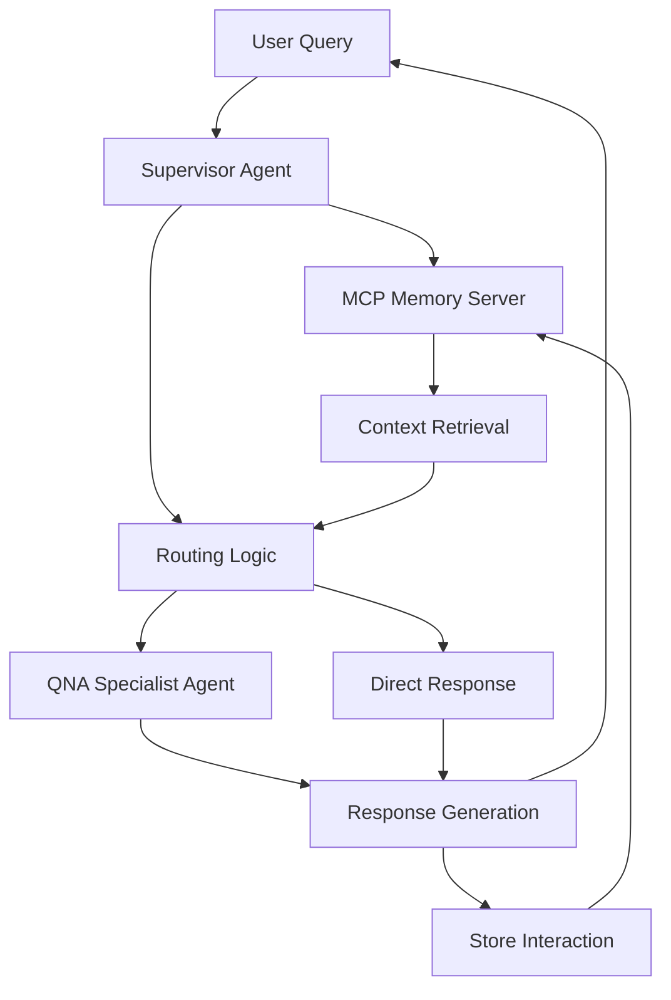
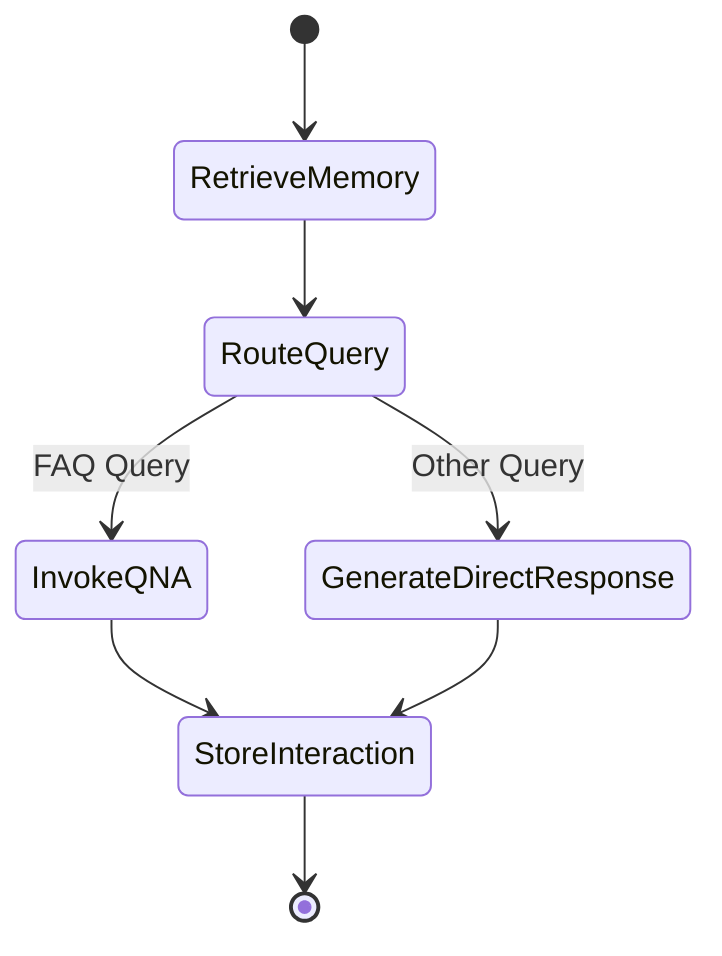

# Design Document: Supervisor Agent Orchestrator

## Overview

The Supervisor Agent Orchestrator is a LangGraph-based orchestration system that intelligently routes user queries to specialized agents, maintains conversation context through MCP memory integration, and manages multi-step workflows. Built on Python 3.13+ and deployed via Amazon Bedrock AgentCore, it serves as the central coordination point for the AgentCore architecture.

The system uses a state machine approach where each user interaction flows through distinct phases: memory retrieval, routing decision, specialist invocation, and memory storage. The Groq LLM (openai/gpt-oss-20b) powers intelligent routing decisions and direct response generation.

## Architecture

### High-Level Architecture



### State Machine Flow

The supervisor implements a LangGraph state machine with the following nodes:



### Component Architecture

1. **Supervisor Agent Core**: LangGraph-based orchestrator managing state transitions
2. **Memory Integration Layer**: MCP client for memory operations
3. **Routing Engine**: LLM-powered decision maker for query classification
4. **Specialist Invocation Layer**: HTTP client for calling specialist agents
5. **Configuration Manager**: Environment-based configuration loader
6. **Logging System**: Structured logging for observability

## Components and Interfaces

### 1. Supervisor Agent (SupervisorAgent)

The main orchestration component built with LangGraph.

**Responsibilities:**
- Manage conversation state across workflow steps
- Coordinate memory retrieval and storage
- Make routing decisions
- Invoke specialist agents
- Generate responses

**Key Methods:**
```python
class SupervisorAgent:
    def __init__(self, config: AgentConfig):
        """Initialize with configuration including LLM, memory client, and specialist endpoints"""
        
    async def process_query(
        self, 
        query: str, 
        actor_id: str, 
        session_id: str
    ) -> AgentResponse:
        """Main entry point for processing user queries"""
        
    async def _retrieve_memory(self, state: AgentState) -> AgentState:
        """Retrieve relevant memory context"""
        
    async def _route_query(self, state: AgentState) -> AgentState:
        """Determine routing destination using LLM"""
        
    async def _invoke_specialist(self, state: AgentState) -> AgentState:
        """Call the appropriate specialist agent"""
        
    async def _generate_direct_response(self, state: AgentState) -> AgentState:
        """Generate response directly using LLM"""
        
    async def _store_interaction(self, state: AgentState) -> AgentState:
        """Store the interaction in memory"""
```

**State Schema:**
```python
class AgentState(TypedDict):
    query: str
    actor_id: str
    session_id: str
    memory_context: List[Dict[str, Any]]
    routing_decision: str  # "qna_specialist" | "direct_response"
    specialist_response: Optional[str]
    final_response: str
    error: Optional[str]
```

### 2. Memory Client (MCPMemoryClient)

Handles all interactions with the MCP Memory Server.

**Responsibilities:**
- Retrieve relevant memories based on query
- Store user-assistant interactions
- Handle memory server errors gracefully

**Key Methods:**
```python
class MCPMemoryClient:
    def __init__(self, server_url: str, timeout: int = 30):
        """Initialize with MCP server configuration"""
        
    async def retrieve_memory(
        self,
        query: str,
        actor_id: str,
        session_id: str,
        max_results: int = 5
    ) -> List[Dict[str, Any]]:
        """Retrieve relevant memories"""
        
    async def store_interaction(
        self,
        user_msg: str,
        assistant_msg: str,
        actor_id: str,
        session_id: str
    ) -> bool:
        """Store an interaction in memory"""
        
    async def get_server_info(self, session_id: str) -> Dict[str, Any]:
        """Get MCP server information"""
```

### 3. Routing Engine (QueryRouter)

Uses LLM to classify queries and determine routing.

**Responsibilities:**
- Analyze query content and intent
- Classify queries into routing categories
- Provide reasoning for routing decisions

**Key Methods:**
```python
class QueryRouter:
    def __init__(self, llm: BaseLLM):
        """Initialize with LLM instance"""
        
    async def route(
        self,
        query: str,
        memory_context: List[Dict[str, Any]]
    ) -> RoutingDecision:
        """Determine routing destination"""
        
    def _build_routing_prompt(
        self,
        query: str,
        memory_context: List[Dict[str, Any]]
    ) -> str:
        """Build prompt for routing decision"""
```

**Routing Decision Schema:**
```python
class RoutingDecision(BaseModel):
    destination: str  # "qna_specialist" | "direct_response"
    confidence: float  # 0.0 to 1.0
    reasoning: str
```

### 4. Specialist Invocation Client (SpecialistClient)

Handles HTTP calls to specialist agents.

**Responsibilities:**
- Invoke QNA specialist agent
- Handle network errors and retries
- Format requests and parse responses

**Key Methods:**
```python
class SpecialistClient:
    def __init__(self, endpoints: Dict[str, str], timeout: int = 60):
        """Initialize with specialist endpoints"""
        
    async def invoke_qna_specialist(
        self,
        query: str,
        context: Optional[str] = None
    ) -> str:
        """Invoke QNA specialist agent"""
        
    async def _retry_with_backoff(
        self,
        func: Callable,
        max_retries: int = 3
    ) -> Any:
        """Retry failed requests with exponential backoff"""
```

### 5. Configuration Manager (ConfigManager)

Loads and validates configuration from environment variables.

**Responsibilities:**
- Load environment variables
- Validate required configuration
- Provide default values
- Expose configuration to components

**Key Methods:**
```python
class ConfigManager:
    @staticmethod
    def load() -> AgentConfig:
        """Load configuration from environment"""
        
    @staticmethod
    def validate(config: AgentConfig) -> None:
        """Validate configuration completeness"""
```

**Configuration Schema:**
```python
class AgentConfig(BaseModel):
    groq_api_key: str
    groq_model: str = "openai/gpt-oss-20b"
    mcp_memory_server_url: str
    qna_specialist_endpoint: str
    log_level: str = "INFO"
    max_memory_results: int = 5
    llm_temperature: float = 0.7
    llm_max_tokens: int = 1000
    request_timeout: int = 60
```

### 6. AgentCore Runtime Handler (AgentCoreHandler)

Provides the HTTP interface for AgentCore deployment.

**Responsibilities:**
- Handle HTTP requests from AgentCore runtime
- Parse request payloads
- Format responses according to AgentCore spec
- Handle errors and return appropriate status codes

**Key Methods:**
```python
class AgentCoreHandler:
    def __init__(self, supervisor: SupervisorAgent):
        """Initialize with supervisor instance"""
        
    async def handle_request(self, request: Dict[str, Any]) -> Dict[str, Any]:
        """Handle incoming AgentCore request"""
        
    def _parse_request(self, request: Dict[str, Any]) -> QueryRequest:
        """Parse and validate request payload"""
        
    def _format_response(self, response: AgentResponse) -> Dict[str, Any]:
        """Format response for AgentCore"""
```

## Data Models

### Request/Response Models

```python
class QueryRequest(BaseModel):
    query: str
    actor_id: Optional[str] = None
    session_id: Optional[str] = None
    metadata: Optional[Dict[str, Any]] = None

class AgentResponse(BaseModel):
    response: str
    actor_id: str
    session_id: str
    routing_decision: str
    memory_used: bool
    error: Optional[str] = None
    metadata: Dict[str, Any] = {}
```

### Memory Models

```python
class MemoryEntry(BaseModel):
    content: str
    timestamp: str
    actor_id: str
    session_id: str
    relevance_score: Optional[float] = None

class MemoryContext(BaseModel):
    entries: List[MemoryEntry]
    total_retrieved: int
```

## Correctness Properties


A property is a characteristic or behavior that should hold true across all valid executions of a system—essentially, a formal statement about what the system should do. Properties serve as the bridge between human-readable specifications and machine-verifiable correctness guarantees.

### Property 1: Routing produces valid destinations

*For any* user query, the routing function should return a valid routing decision (either "qna_specialist" or "direct_response").

**Validates: Requirements 1.1**

### Property 2: Specialist invocation follows routing decision

*For any* query where routing decision is "qna_specialist", the QNA specialist agent should be invoked with the user query.

**Validates: Requirements 1.3**

### Property 3: Direct response generation for unrouted queries

*For any* query where routing decision is "direct_response", the LLM should generate a direct response without invoking a specialist.

**Validates: Requirements 1.4, 6.2**

### Property 4: Memory context included in specialist invocations

*For any* query with available memory context, when routing to a specialist agent, the invocation should include that memory context.

**Validates: Requirements 1.5**

### Property 5: Memory retrieval precedes response generation

*For any* user query, memory retrieval should be called before any response generation or routing decision is made.

**Validates: Requirements 2.1**

### Property 6: Memory operations use correct identifiers

*For any* query with actor_id and session_id, all memory operations (retrieve and store) should include those exact identifiers.

**Validates: Requirements 2.2, 2.4**

### Property 7: Interaction storage after completion

*For any* completed interaction, the user message and assistant response should be stored in memory with the correct actor_id and session_id.

**Validates: Requirements 2.3**

### Property 8: Resilience to memory failures

*For any* query where memory retrieval fails, the supervisor should continue processing and generate a response without memory context.

**Validates: Requirements 2.5, 5.2**

### Property 9: State persistence across workflow steps

*For any* multi-step workflow, state data from step N should be accessible in step N+1 without loss.

**Validates: Requirements 3.2**

### Property 10: Error handling in workflow steps

*For any* workflow step that fails, the supervisor should either retry the operation or provide an error message without crashing.

**Validates: Requirements 3.4**

### Property 11: Actor ID handling

*For any* query, if actor_id is provided it should be used as-is, and if not provided a valid default identifier should be generated.

**Validates: Requirements 4.1, 4.3**

### Property 12: Session ID handling

*For any* query, if session_id is provided it should be used as-is, and if not provided a new valid session identifier should be generated.

**Validates: Requirements 4.2, 4.4**

### Property 13: Session isolation

*For any* two queries with different actor_id or session_id combinations, their memory contexts and state should not interfere with each other.

**Validates: Requirements 4.5**

### Property 14: Specialist failure fallback

*For any* specialist agent invocation that fails, the supervisor should log the error and provide a fallback response to the user.

**Validates: Requirements 5.1**

### Property 15: LLM retry with exponential backoff

*For any* LLM API call that fails, the supervisor should retry up to 3 times with exponential backoff before giving up.

**Validates: Requirements 5.3**

### Property 16: Error message after retry exhaustion

*For any* operation where all retry attempts fail, the supervisor should return a user-friendly error message.

**Validates: Requirements 5.4**

### Property 17: Error logging

*For any* error that occurs, the supervisor should create a log entry with error details.

**Validates: Requirements 5.5**

### Property 18: System prompts in LLM calls

*For any* LLM call for routing or response generation, the request should include system prompts that define the task.

**Validates: Requirements 6.3**

### Property 19: Configuration validation

*For any* missing required configuration value, the supervisor should fail at startup with a clear error message indicating which value is missing.

**Validates: Requirements 8.4**

### Property 20: Comprehensive logging

*For any* query processing, the supervisor should create log entries for: incoming query, routing decision, specialist invocations, and memory operations.

**Validates: Requirements 9.1, 9.2, 9.3, 9.4**

### Property 21: Structured logging format

*For any* log entry, it should be structured (JSON or key-value format) and include appropriate log level (DEBUG, INFO, WARNING, ERROR).

**Validates: Requirements 9.5**

### Property 22: Specialist output in response

*For any* query routed to a specialist, the final response should include the specialist's output.

**Validates: Requirements 10.1**

### Property 23: Error information in error responses

*For any* query that results in an error, the response should contain information about what went wrong.

**Validates: Requirements 10.3**

### Property 24: Consistent response format

*For any* interaction type (specialist, direct, error), the response should follow the same schema structure (AgentResponse model).

**Validates: Requirements 10.4**

## Error Handling

### Error Categories

1. **Network Errors**: Failed HTTP calls to specialists or memory server
2. **LLM Errors**: API failures, rate limits, timeouts
3. **Validation Errors**: Invalid input data or configuration
4. **State Errors**: Workflow state corruption or inconsistency

### Error Handling Strategies

**Retry with Backoff:**
- LLM API calls: 3 retries with exponential backoff (1s, 2s, 4s)
- Specialist invocations: 3 retries with exponential backoff
- Memory operations: 2 retries with linear backoff (1s, 2s)

**Graceful Degradation:**
- Memory unavailable → Continue without context
- Specialist unavailable → Generate direct response
- LLM unavailable → Return cached/template response

**Error Propagation:**
- Log all errors with full context (actor_id, session_id, query, stack trace)
- Return user-friendly error messages (no stack traces to users)
- Include error codes for debugging (e.g., "ERR_MEMORY_001")

**Circuit Breaker Pattern:**
- After 5 consecutive failures to a service, open circuit for 60 seconds
- During open circuit, fail fast without attempting calls
- After timeout, attempt one call to test if service recovered

### Error Response Format

```python
class ErrorResponse(BaseModel):
    error: str  # User-friendly message
    error_code: str  # Machine-readable code
    details: Optional[Dict[str, Any]] = None  # Additional context
    timestamp: str
    request_id: str
```

## Testing Strategy

### Dual Testing Approach

The supervisor agent requires both unit testing and property-based testing for comprehensive coverage:

**Unit Tests** focus on:
- Specific examples of routing decisions (FAQ queries → QNA specialist)
- Configuration loading and validation edge cases
- Error handling for specific failure scenarios
- Integration points between components
- AgentCore request/response format compliance

**Property-Based Tests** focus on:
- Universal properties that hold for all inputs
- State management across workflow steps
- Memory operation correctness
- Error resilience across random failure scenarios
- Logging completeness across all execution paths

### Property-Based Testing Configuration

**Library**: Use `hypothesis` for Python property-based testing

**Configuration**:
- Minimum 100 iterations per property test
- Each test must reference its design document property
- Tag format: `# Feature: supervisor-agent-orchestrator, Property {N}: {property_text}`

**Example Property Test Structure**:
```python
from hypothesis import given, strategies as st

@given(
    query=st.text(min_size=1, max_size=500),
    actor_id=st.uuids(),
    session_id=st.uuids()
)
@settings(max_examples=100)
def test_property_6_memory_operations_use_correct_identifiers(query, actor_id, session_id):
    """
    Feature: supervisor-agent-orchestrator
    Property 6: Memory operations use correct identifiers
    
    For any query with actor_id and session_id, all memory operations
    should include those exact identifiers.
    """
    # Test implementation
    pass
```

### Test Coverage Requirements

**Unit Test Coverage**:
- All public methods in each component
- Configuration loading with various env var combinations
- Error handling for each error category
- Request/response parsing and formatting

**Property Test Coverage**:
- Each correctness property must have exactly one property-based test
- Properties 1-24 must all be implemented as property tests
- Each property test must run minimum 100 iterations

### Integration Testing

**Mock Services**:
- Mock MCP Memory Server for testing memory operations
- Mock QNA Specialist endpoint for testing specialist invocations
- Mock Groq LLM for testing routing and response generation

**Test Scenarios**:
1. End-to-end query processing with all services available
2. Query processing with memory service unavailable
3. Query processing with specialist service unavailable
4. Query processing with LLM service unavailable
5. Concurrent queries from multiple actors/sessions

### Performance Testing

**Load Testing**:
- 100 concurrent queries with 95th percentile latency < 2 seconds
- Memory operations should complete in < 500ms
- Specialist invocations should timeout after 60 seconds

**Stress Testing**:
- System should handle memory service downtime gracefully
- System should handle LLM rate limiting without crashing
- System should maintain state consistency under high load

## Deployment Configuration

### AgentCore Configuration File

The `.bedrock_agentcore.yaml` file structure:

```yaml
runtime: python3.13
handler: main.handler
timeout: 300
memory: 512

environment:
  GROQ_API_KEY: ${GROQ_API_KEY}
  GROQ_MODEL: openai/gpt-oss-20b
  MCP_MEMORY_SERVER_URL: ${MCP_MEMORY_SERVER_URL}
  QNA_SPECIALIST_ENDPOINT: ${QNA_SPECIALIST_ENDPOINT}
  LOG_LEVEL: INFO
  MAX_MEMORY_RESULTS: 5
  LLM_TEMPERATURE: 0.7
  LLM_MAX_TOKENS: 1000
  REQUEST_TIMEOUT: 60

dependencies:
  - langchain>=0.1.0
  - langgraph>=0.0.20
  - groq>=0.4.0
  - httpx>=0.25.0
  - pydantic>=2.0.0
  - python-dotenv>=1.0.0

logging:
  level: ${LOG_LEVEL}
  format: json
  destination: cloudwatch
```

### Environment Variables

**Required**:
- `GROQ_API_KEY`: API key for Groq LLM
- `MCP_MEMORY_SERVER_URL`: URL of the MCP memory server
- `QNA_SPECIALIST_ENDPOINT`: URL of the QNA specialist agent

**Optional** (with defaults):
- `GROQ_MODEL`: LLM model name (default: "openai/gpt-oss-20b")
- `LOG_LEVEL`: Logging level (default: "INFO")
- `MAX_MEMORY_RESULTS`: Max memories to retrieve (default: 5)
- `LLM_TEMPERATURE`: LLM temperature (default: 0.7)
- `LLM_MAX_TOKENS`: Max tokens for LLM (default: 1000)
- `REQUEST_TIMEOUT`: HTTP request timeout in seconds (default: 60)

### Deployment Steps

1. Set all required environment variables in AgentCore console
2. Deploy the application using AgentCore CLI or console
3. Verify deployment by checking logs for successful startup
4. Test with a sample query to verify end-to-end functionality
5. Monitor CloudWatch logs for errors or performance issues

### Monitoring and Observability

**Key Metrics**:
- Request count per minute
- Average response latency
- Error rate by error type
- Memory operation success rate
- Specialist invocation success rate
- LLM API call success rate

**Alarms**:
- Error rate > 5% for 5 minutes
- Average latency > 3 seconds for 5 minutes
- Memory service unavailable for > 1 minute
- Specialist service unavailable for > 1 minute

**Log Aggregation**:
- All logs sent to CloudWatch Logs
- Structured JSON format for easy parsing
- Include request_id for tracing requests across services
- Include actor_id and session_id for user-specific debugging
